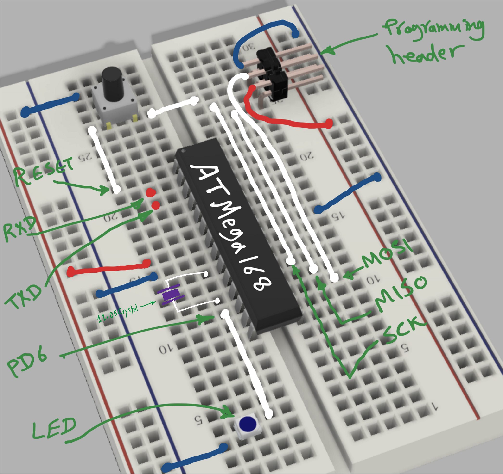

# Termethos-demo-avr
An ATMega168 code to demo Termethos (https://www.termethos.com) smart terminal

**NOTE**: Use termethos.json for best experience. Remember to backup your original configs.

## Hardware used
 - Breadboard & wires (see layout image below)
 - ATMega186, DIP 28 pins
 - 6 bin header for programming. top 3 pins were cut and to fit and connect properly to breadboard
 - Push button as a reset switch (salvaged from an old board!)
 - LED
 - Atmel at AVR ISP MK2 AVR Programmer (https://www.amazon.com/gp/product/B07L3DT86R)
 - SH-U09C2 USB to TTL Adapter Built-in FTDI FT232RL IC for Debugging and Programming (https://www.amazon.com/gp/product/B07TXVRQ7V)
 - Optional: power source and regulator (I use the ISP as power source as well!)

Simple breadboard circuit:

